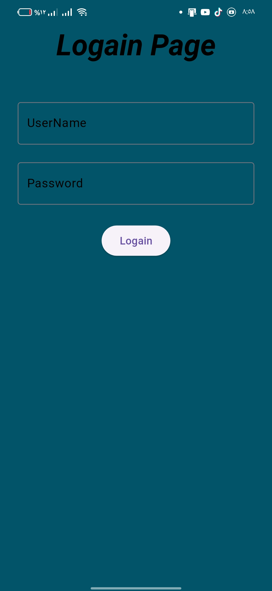
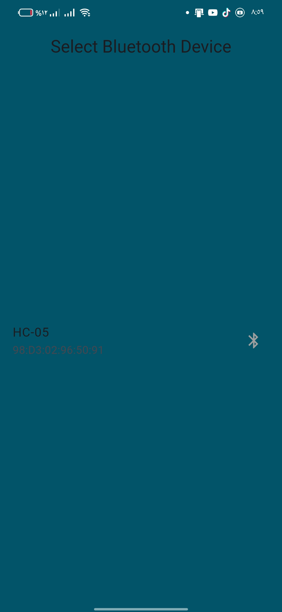
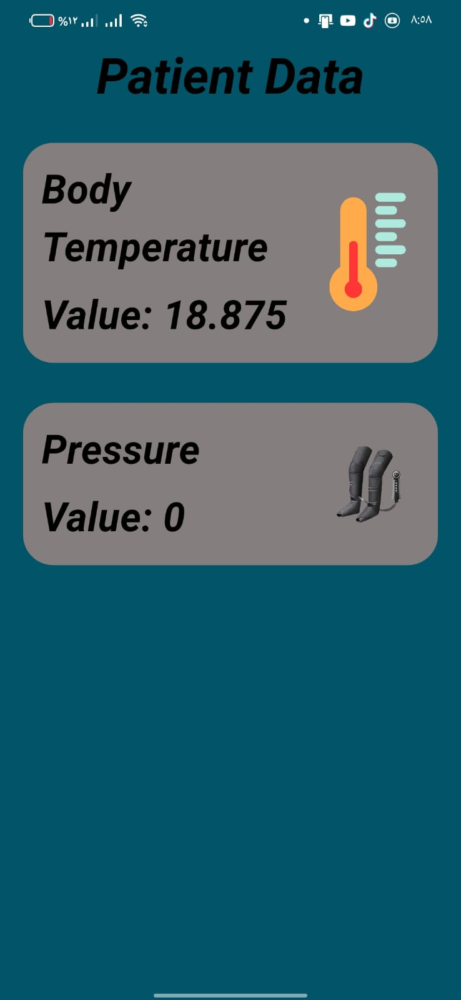

# Lymphoedemo App

## 📌 Overview
Lymphoedemo is a Flutter-based mobile application designed to monitor patient data using Bluetooth-connected devices. It retrieves and displays real-time health metrics such as **Body Temperature** and **Pressure**.

## 🛠 Features
- **Bluetooth Connectivity**: Scan and connect to available Bluetooth devices.
- **Real-time Data Streaming**: Display temperature and pressure readings.
- **Responsive UI**: Ensures compatibility with all screen sizes.
- **Secure Login**: Only authorized users can access patient data.
- **Permissions Handling**: Automatically requests necessary Bluetooth permissions.

## 📱 Screens
1. **Login Page** - Secure authentication for users.
2. **Bluetooth Device Selection** - List of available devices for connection.
3. **Patient Data Page** - Displays real-time readings from connected devices.

## 🏗️ Technologies Used
- **Flutter** (Dart)
- **Provider** (State Management)
- **Bluetooth Classic** (for Bluetooth communication)
- **Permission Handler** (for managing permissions)

## 🚀 Getting Started
### Prerequisites
- Flutter SDK (latest version)
- Android Studio or VS Code
- A Bluetooth-enabled device for testing

### Installation
1. **Clone the repository**:
   ```sh
   git clonehttps://github.com/KhaledElKenawy00/lemphodema
   ```
2. **Navigate to the project directory**:
   ```sh
   cd lymphoedemo
   ```
3. **Install dependencies**:
   ```sh
   flutter pub get
   ```
4. **Run the app**:
   ```sh
   flutter run
   ```

## 🔌 Bluetooth Permissions Setup
For Android, ensure the `AndroidManifest.xml` includes:
```xml
<uses-permission android:name="android.permission.BLUETOOTH"/>
<uses-permission android:name="android.permission.BLUETOOTH_ADMIN"/>
<uses-permission android:name="android.permission.BLUETOOTH_CONNECT"/>
<uses-permission android:name="android.permission.BLUETOOTH_SCAN"/>
<uses-permission android:name="android.permission.NEARBY_WIFI_DEVICES"/>
```

## 📂 Folder Structure
```
lib/
│── constant/             # App constants & dimensions
│── provider/             # State management (Provider)
│── screen/               # UI Screens
│── main.dart             # Entry point
```

## 🛠 Future Enhancements
- **More Health Metrics**: Support for additional sensors.
- **Data Logging**: Store historical health data.
- **Dark Mode**: Improve UI accessibility.

## 🤝 Contributing
Feel free to contribute! Fork the repo, create a new branch, and submit a pull request.

## 📜 License
This project is licensed under the MIT License.

## 📖 Preview
Below are some UI previews:

# Login Page


# Scan Bluetooth Devices


### Patient Data Page


